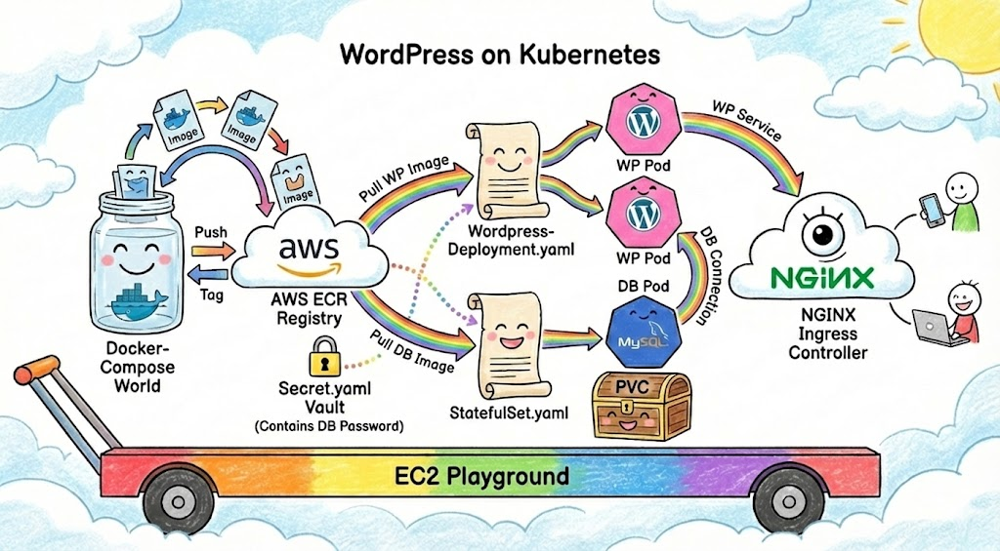

# WordPress Deployment on Kubernetes 🚀

## Project Overview 📋
This project executes a migration of a WordPress application from a Docker-Compose environment to a Kubernetes cluster. The primary goal was to enhance scalability, reliability, and manageability by leveraging Kubernetes orchestration, Helm package management, and AWS ECR for container storage.

## Containerization Lifecycle 📦
The migration began with preparing the container images for the cloud environment:
1.  **Build & Tag**:
    *   Pulled the official WordPress and MySQL images.
    *   Tagged them specifically for the Amazon Elastic Container Registry (ECR) target repositories (e.g., `nadav-project/wordpress`, `nadav-project/mariadb`).
2.  **Registry Push**:
    *   Authenticated the local Docker client with AWS ECR using `aws ecr get-login-password`.
    *   Pushed the tagged images to the private ECR repositories to ensure secure and reliable image availability for the cluster.

## Helm Package Structure 📂
The application is packaged as a unified Helm chart for consistent deployment:

```text
wordpress-project/
├── Chart.yaml                  # Chart metadata and versioning
├── values.yaml                 # Configuration defaults (image refs, replicas, ports)
└── templates/
    ├── ingress.yaml            # Ingress rules for external access
    ├── mysql-statefulset.yaml  # StatefulSet for database consistency
    ├── secret.yaml             # Encoded secrets for DB credentials
    └── wordpress_deployment.yaml # Deployment logic for the WordPress app
```

## Infrastructure & Automation 🏗️
*   **Minikube Addons**: Utilized the `registry-creds` addon (`minikube addons enable registry-creds`) to automate the retrieval and renewal of AWS ECR credentials, allowing the cluster to pull private images seamlessly without manual secret rotation.
*   **Helm Orchestration**: The entire stack—including the application, database, ingress rules, and secrets—is managed as a single atomic Helm release (`nadav-wordpress`).
*   **Port-Forwarding Strategy**: To bridge the gap between the EC2/Minikube isolated network and the user, custom scripts in the `bin/` directory manage port forwarding background processes, mapping local ports to Ingress/Service ports (8080 -> 80, 3000 -> Grafana).


### Ingress Controller
I installed the NGINX Ingress Controller to manage external access.
```bash
helm repo add ingress-nginx https://kubernetes.github.io/ingress-nginx
helm install my-ingress ingress-nginx/ingress-nginx --namespace ingress-nginx --create-namespace
```

### Application Deployment using helm
Finally, I deployed the custom Helm chart. This single command is initiating all resources defined in the package structure, including 2 replicas of the wordpress pod.
Example:
```bash
helm helm install nadav-wordpress ./wordpress-project --set mysql.rootPassword=MySecurePassword123
```
> [!IMPORTANT]
> The user should use the ```--set```, this action will "run over" the password used inside values.yaml, this grants more security.

### Access
Executed the port-forwarding automation script to expose the application:
```bash
./bin/port-forwardings.sh
```

## Observability Implementation 📊
*   **Monitoring Stack**: Deployed the **kube-prometheus-stack** to provide a complete monitoring solution (Prometheus, Grafana, Alertmanager).
*   **Uptime Monitoring**: Configured a custom **Uptime Panel** in Grafana to track the duration of pod operation.
    *   **Query**: `time()-kube_pod_start_time{namespace="default", pod=~"wordpress.*"}`
    *   **Purpose**: Visualizes the uptime duration of the WordPress pods since their last start.

## Cleanup 🧹
To uninstall the release and free up resources:
```bash
helm uninstall nadav-wordpress
minikube delete
```


